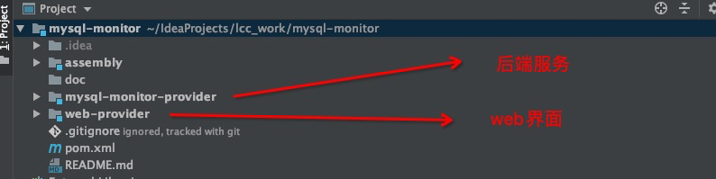
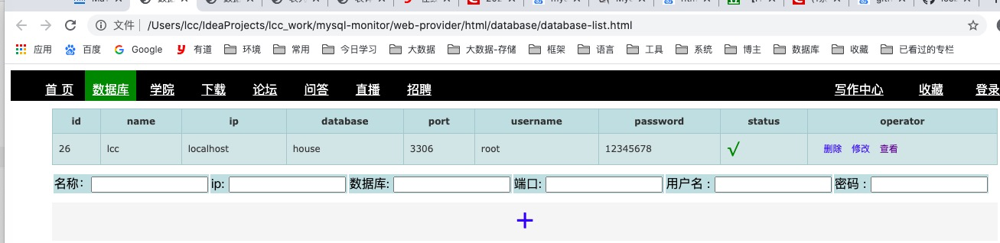
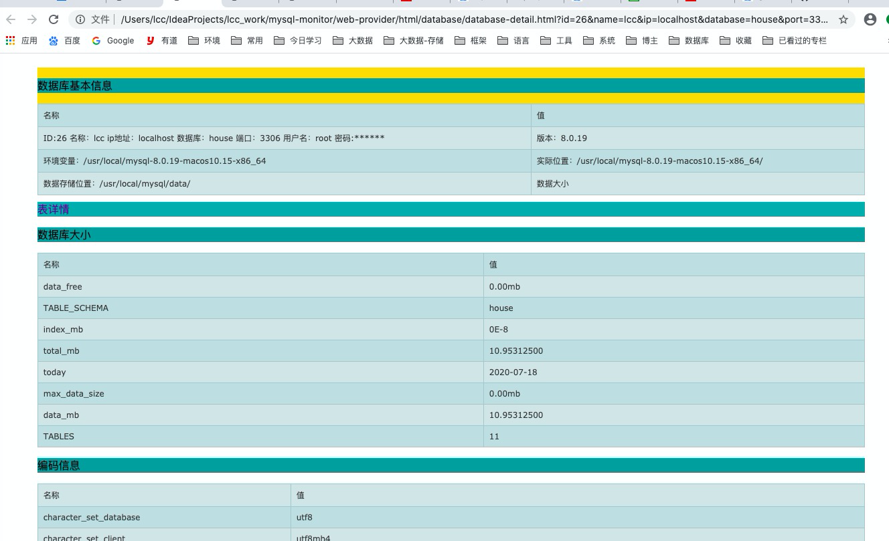
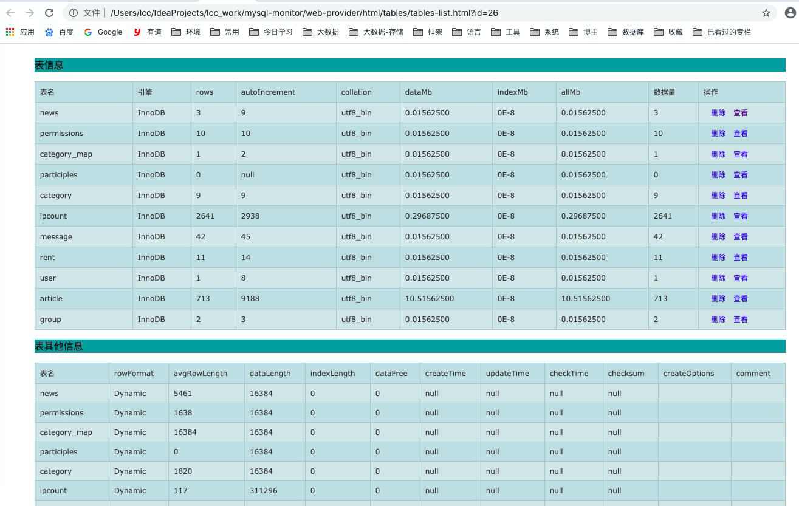
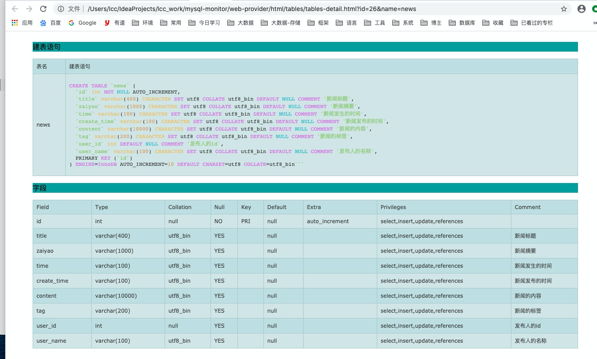

# mysql-monitor
MYSQL 监控工具，优化工具，各种工具为一体的java spring boot 项目


# 2. 代码架构



# 3. 后端服务

后端服务的主类是`com.neo.MySQLMointorApplication`

## 3.1 后端服务的数据库

```shell
spring.datasource.driverClassName = com.mysql.jdbc.Driver
spring.datasource.url = jdbc:mysql://localhost:3306/mysql_monitor?useUnicode=true&characterEncoding=utf-8&useSSL=true
spring.datasource.username = root
spring.datasource.password = 12345678
```

这个根据自己的需要进行修改。

SQL运行的脚本在`doc/sql/mysql_monitor.sql`请先执行建表操作，然后运行主类。

# 4.前端服务

前端主页面：`web-provider/html/database/database-list.html`

因为是前后端分离，采用最原始的html+jquery+ajax操作后端并且显示，解决了跨域的问题。直接打开页面即可。

## 4.1 配置

前端的配置文件如下：`web-provider/js/constant.js`

```shell
//定义几个全局变量
var AppUrl = "http://localhost:8090";//整个页面的请求页面

```

主要配置后端请求的地址。

# 5.效果如下

## 5.1 数据库列表页面



## 5.2 数据库详情页面



## 5.3 表列表页面



## 5.4 表详情页面




后面还会开发更多功能。。。等待中。。

# 7.目标
最终目标是实现mysql运维监控一体化，而且是只针对MySQL的，其他的数据库不管。主要目标是实现
开发人员以后只需要会用MySQL会用这个工具就行了，自动帮我们分析出表的不好的地方，以及SQL写的不好的地方
让开发人员靠着这个能当一个MySQL DBA

目前想到的功能

1. SQL 执行优化，开发人员，写了一个SQL,不知道性能好不好，只需要在页面上，点击输入SQL，然后会模拟各种
   执行，并且绘制成表格，显示各种优化的SQL执行。这个要采用Antlr进行词法分析，语法分析。
2. 自动分析表结构，比如设置了varchar（100），如果你的数据只用了50个字节，那么算出你这个字段损失的空间，磁盘
3. 自动采样索引形成树形图，展示在页面，让我们对我们建立的索引有个大概的真实样子
4. 大量的性能监控图
5. 